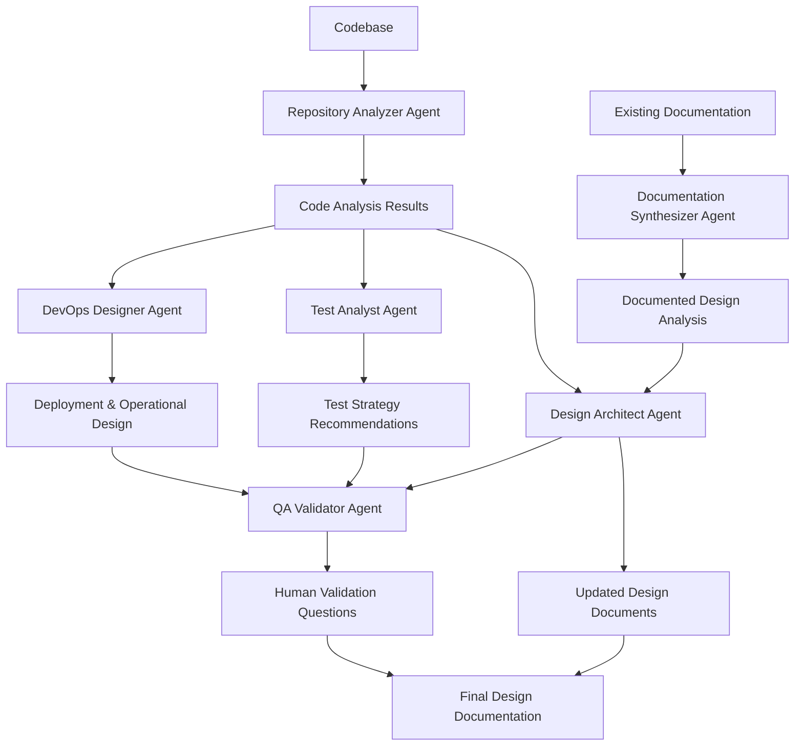
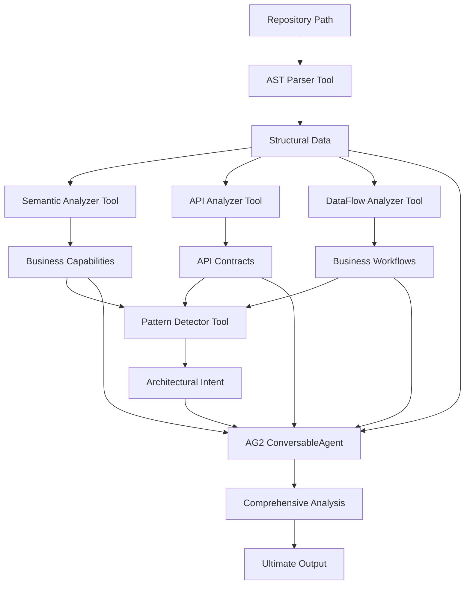

# 🏗️ Repository Analyzer Agent - Ultimate Implementation

A comprehensive AI-powered repository analysis system that provides semantic, structural, and behavioral analysis of codebases using the AG2 framework with ConversableAgent and LLMConfig.

## 🎯 Overview

The Repository Analyzer Agent is designed to extract complete understanding of codebases through advanced analysis techniques, providing insights that are ready for downstream design agents and documentation synthesis.

## 🔄 Workflow 1: Code to Design - Problem Statement

### **Objective**
Reverse-engineer accurate design documentation from an existing codebase by reconciling code reality with existing documentation through AI agent collaboration.

### **Agent Sequence & Responsibilities**

#### **1. Repository Analyzer Agent** ✅ *IMPLEMENTED*
- **Purpose**: Analyze codebase structure, extract architectural patterns, and understand business semantics from the actual implementation
- **Key Capabilities**:
  - Semantic analysis of business domain and capabilities
  - Advanced structural analysis with AST parsing
  - Behavioral analysis of API contracts and workflows
  - Architectural intent detection and pattern recognition
  - Gap analysis readiness for design reconciliation

#### **2. Documentation Synthesizer Agent** 🚧 *PENDING*
- **Purpose**: Parse existing design/requirements documents to understand the documented system architecture and intended design
- **Key Capabilities**:
  - Extract architectural information from existing documentation
  - Parse requirements and design specifications
  - Identify documented patterns and design decisions
  - Map documented components to business capabilities

#### **3. Design Architect Agent** 🚧 *PENDING*
- **Purpose**: Compare code reality vs documented design, identify gaps/discrepancies, and generate updated design documents
- **Key Capabilities**:
  - Compare code analysis with documented design
  - Identify architectural gaps and inconsistencies
  - Generate updated design documents
  - Propose design improvements and alignments

#### **4. Test Analyst Agent** 🚧 *PENDING*
- **Purpose**: Analyze existing tests and propose comprehensive test strategies based on the actual code implementation
- **Key Capabilities**:
  - Analyze existing test coverage and quality
  - Identify missing test scenarios
  - Propose comprehensive test strategies
  - Generate test recommendations based on code analysis

#### **5. DevOps Designer Agent** 🚧 *PENDING*
- **Purpose**: Create deployment and operational design by analyzing logs and infrastructure patterns
- **Key Capabilities**:
  - Analyze deployment patterns and infrastructure
  - Review operational logs and monitoring
  - Design deployment and operational strategies
  - Propose infrastructure improvements

#### **6. QA Validator Agent** 🚧 *PENDING*
- **Purpose**: Generate intelligent clarification questions and validation points for human review
- **Key Capabilities**:
  - Generate validation questions for human review
  - Identify critical decision points
  - Create quality assurance checkpoints
  - Ensure design accuracy and completeness

### **Final Output**
Updated design documents that accurately reflect the current codebase, with identified gaps and human-validation questions.

### **Workflow Architecture**



## ✨ Key Features

### 🧠 **Semantic Analysis**
- **Business Domain Extraction**: Understands what the code actually does business-wise
- **Domain Model Understanding**: Identifies entities, aggregates, and business rules
- **Service Boundary Detection**: Maps technical components to business capabilities
- **Business Rule Extraction**: Extracts validation rules and business logic

### 🔍 **Advanced Structural Analysis**
- **Semantic AST Parsing**: Goes beyond syntax to understand code semantics
- **Function Interconnection Mapping**: Maps how functions are connected and depend on each other
- **Class Relationship Analysis**: Understands inheritance, composition, and dependencies
- **Dependency Graph Construction**: Builds comprehensive dependency networks

### ⚡ **Behavioral Analysis**
- **API Contract Extraction**: Analyzes API endpoints, data models, and interfaces
- **Business Process Identification**: Maps business workflows and processes
- **Data Flow Tracing**: Traces how data flows through the system
- **State Management Analysis**: Identifies state management patterns

### 🏗️ **Architectural Intent Detection**
- **Design Pattern Detection**: Identifies design patterns with confidence scores
- **Architectural Pattern Recognition**: Detects layered, hexagonal, microservices patterns
- **Design Decision Reverse Engineering**: Understands why technical decisions were made
- **Quality Attribute Assessment**: Evaluates maintainability, testability, scalability

### 📊 **Gap Analysis Readiness**
- **Design Concept Mapping**: Maps code components to abstract design concepts
- **Component Traceability Matrix**: Links business capabilities to code components
- **Reconciliation Question Generation**: Generates questions for design reconciliation
- **Design Gap Identification**: Identifies inconsistencies and improvement areas

## 🏛️ Architecture

### **Core Components**



### **Tool Suite**

1. **SemanticCodeAnalyzer**: Business domain extraction and understanding
2. **SemanticASTParser**: Advanced AST parsing with semantic context
3. **AdvancedPatternDetector**: Architectural intent and design decisions
4. **APIContractAnalyzer**: API semantics and contract extraction
5. **DataFlowAnalyzer**: Business workflows and data flow tracing

## 🚀 Quick Start

### **Installation**

```bash
# Clone the repository
git clone <repository-url>
cd AG2-SDLC

# Install dependencies
pip install -r requirements.txt

# Set up environment variables
cp .env.example .env
# Add your OpenAI API key to .env
```

### **Basic Usage**

```python
from agents.repository_analyzer.ultimate_analyzer import UltimateRepositoryAnalyzer

# Initialize the analyzer
analyzer = UltimateRepositoryAnalyzer(
    model_name="gpt-4o-mini",
    temperature=0.1
)

# Run ultimate analysis
result = analyzer.ultimate_repository_analysis(
    repo_path="path/to/your/repository",
    file_patterns=["*.py", "*.js", "*.ts"],
    analysis_config={
        "depth_level": "ultimate",
        "focus_areas": ["semantic", "structural", "behavioral", "architectural"]
    }
)

# Access results
print(f"Business Capabilities: {len(result['semantic_analysis']['business_capabilities'])}")
print(f"API Contracts: {len(result['behavioral_analysis']['api_contracts'])}")
print(f"Design Patterns: {len(result['architectural_intent']['design_patterns_detected'])}")
```

## 📊 Output Structure

The analyzer provides comprehensive structured output:

```json
{
  "structural_analysis": {
    "repo_metadata": {
      "name": "repository_name",
      "total_files": 5,
      "total_functions": 74,
      "total_classes": 96,
      "languages": ["Python"],
      "analysis_timestamp": "2024-01-01T00:00:00"
    },
    "architecture_analysis": {
      "pattern": "Layered Architecture",
      "confidence": 0.75,
      "components": ["UserService", "BookingService"],
      "entry_points": ["User Registration", "Booking Management"],
      "design_principles": ["Single Responsibility Principle"]
    },
    "code_quality_metrics": {
      "average_complexity": 0.43,
      "max_complexity": 4,
      "documentation_coverage": 0.0,
      "maintainability_index": 47.84,
      "technical_debt_score": 52.16
    },
    "detected_patterns": [...]
  },
  "semantic_analysis": {
    "business_capabilities": [...],
    "domain_models": {...},
    "service_boundaries": [...]
  },
  "behavioral_analysis": {
    "api_contracts": [...],
    "business_processes": [...],
    "data_flow_graph": {...},
    "business_workflows": [...],
    "error_handling_strategy": {...}
  },
  "architectural_intent": {
    "design_decisions_identified": [...],
    "architecture_consistency": {...},
    "quality_attributes_addressed": [...]
  },
  "gap_analysis_readiness": {
    "mapping_to_design_concepts": [...],
    "questions_for_design_reconciliation": [...],
    "component_traceability": {...}
  }
}
```

## 🔧 Configuration

### **Analysis Configuration**

```python
analysis_config = {
    "depth_level": "ultimate",  # Analysis depth
    "focus_areas": [            # Areas to focus on
        "semantic",             # Business domain understanding
        "structural",           # Code structure analysis
        "behavioral",           # API and workflow analysis
        "architectural"         # Design pattern detection
    ],
    "include_business_analysis": True,
    "include_pattern_detection": True,
    "include_api_analysis": True,
    "include_dataflow_analysis": True,
    "generate_design_recommendations": True
}
```

### **Model Configuration**

```python
analyzer = UltimateRepositoryAnalyzer(
    model_name="gpt-4o-mini",  # OpenAI model
    temperature=0.1            # Response creativity (0.0-1.0)
)
```

## 🧪 Testing

### **Run Tests**

```bash
# Test the ultimate analyzer
python scripts/test_ultimate_analyzer.py

# Test with specific repository
python scripts/test_booking_analyzer.py
```

### **Test Results**

The test suite validates:
- ✅ Semantic analysis capabilities
- ✅ Structural analysis with AST parsing
- ✅ Behavioral analysis with API contracts
- ✅ Architectural intent detection
- ✅ AG2 framework integration
- ✅ Gap analysis readiness

## 📈 Performance

### **Analysis Speed**
- **Small repositories** (< 10 files): ~5-10 seconds
- **Medium repositories** (10-50 files): ~15-30 seconds
- **Large repositories** (50+ files): ~30-60 seconds

### **Memory Usage**
- **Efficient AST parsing** with minimal memory footprint
- **Strategic code selection** to avoid token limits
- **Streaming analysis** for large codebases

## 🎯 Use Cases

### **1. Documentation Synthesis**
- Compare existing design with current codebase
- Identify semantic gaps and inconsistencies
- Generate precise reconciliation questions

### **2. Design Architecture**
- Update architectural documentation
- Propose design improvements
- Ensure design-code alignment

### **3. Gap Analysis**
- Detailed component-to-design mapping
- Business capability traceability
- Architecture consistency assessment

### **4. Code Quality Assessment**
- Maintainability analysis
- Technical debt identification
- Design pattern compliance

## 🔍 Advanced Features

### **Strategic Code Selection**
The analyzer intelligently selects only essential code for LLM analysis:

```python
def _select_representative_code_samples(self, structural_data):
    """Select only high-complexity functions and key classes"""
    high_complexity_functions = sorted(
        [f for f in functions if f.get("semantic_complexity", {}).get("business_rules", 0) > 3],
        key=lambda x: x.get("semantic_complexity", {}).get("business_rules", 0),
        reverse=True
    )[:5]  # Only top 5 most complex functions
```

### **Business Domain Understanding**
Extracts business meaning from technical implementation:

```python
# Identifies business capabilities like:
- "User Registration and Management"
- "Booking and Reservation Management" 
- "Payment Processing"
- "Notification System"
- "Security and Authentication"
```

### **Architectural Pattern Detection**
Detects and analyzes architectural patterns:

```python
# Recognizes patterns like:
- Layered Architecture
- Service Layer Pattern
- Repository Pattern
- Factory Pattern
- Observer Pattern
```

## 🛠️ Development

### **Project Structure**

```
agents/repository_analyzer/
├── ultimate_analyzer.py          # Main analyzer class
├── semantic_analyzer.py          # Business domain analysis
├── advanced_ast_parser.py        # Semantic AST parsing
├── pattern_detector.py           # Architectural pattern detection
├── api_analyzer.py               # API contract analysis
├── dataflow_analyzer.py          # Data flow and workflow analysis
└── __init__.py                   # Module exports
```

### **Adding New Analysis Tools**

1. Create a new analyzer class
2. Implement the analysis logic
3. Add it to the ultimate analyzer pipeline
4. Update the output structure

### **Customizing Analysis**

```python
class CustomRepositoryAnalyzer(UltimateRepositoryAnalyzer):
    def _custom_analysis_phase(self, data):
        """Add custom analysis logic"""
        # Your custom analysis here
        return custom_results
```

## 📚 API Reference

### **UltimateRepositoryAnalyzer**

#### **Constructor**
```python
UltimateRepositoryAnalyzer(model_name: str = "gpt-4o-mini", temperature: float = 0.1)
```

#### **Methods**

##### **ultimate_repository_analysis**
```python
def ultimate_repository_analysis(
    self, 
    repo_path: str, 
    file_patterns: List[str] = None, 
    analysis_config: Dict[str, Any] = None
) -> Dict[str, Any]
```

**Parameters:**
- `repo_path`: Path to repository to analyze
- `file_patterns`: File patterns to include (default: `["*.py", "*.js", "*.ts"]`)
- `analysis_config`: Analysis configuration options

**Returns:**
- Comprehensive analysis results dictionary

## 🤝 Contributing

1. Fork the repository
2. Create a feature branch
3. Make your changes
4. Add tests
5. Submit a pull request

## 📄 License

This project is licensed under the MIT License - see the LICENSE file for details.

## 🙏 Acknowledgments

- **AG2 Framework** for ConversableAgent and LLMConfig
- **OpenAI** for language model capabilities
- **Python AST** for code parsing
- **Community** for feedback and contributions

## 📞 Support

For questions, issues, or contributions:
- Create an issue on GitHub
- Contact the development team
- Check the documentation

---

**Built with ❤️ using the AG2 Framework for intelligent repository analysis**