# 🏗️ AG2 Multi-Agent Frontend Analysis System

A sophisticated multi-agent system built with **AG2 (Autogen 2.0)** for React/TypeScript codebase analysis, design gap identification, implementation planning, and automated code generation.

## 🎯 What It Does

The streamlined workflow orchestrates **four specialized agents** using AG2's ConversableAgent framework:

1. **Repository Analyzer Agent** - Hybrid Python+LLM analysis of React/TypeScript codebases
2. **Design Analyzer Agent** - Semantic gap analysis between design docs and implementation
3. **Architect Agent** - Technical implementation planning with file-level specifications
4. **Code Generation Agent** - Automated code changes using AG2 tool calling

## 🧠 AG2 Concepts & Architecture

### Core AG2 Framework Components

#### **ConversableAgent** - The Foundation
Each agent is built using AG2's `ConversableAgent` with:
- **Autonomous LLM conversations** with specialized system messages
- **Function calling** through `function_map` parameter
- **Human input modes** (NEVER, ALWAYS, TERMINATE)
- **Auto-reply limits** to prevent infinite loops
- **Structured LLM configuration** with timeout and temperature controls

#### **LLMConfig** - Model Management
```python
llm_config = {
    "config_list": [{
        "model": "gpt-4o-mini",
        "temperature": 0.1
    }],
    "timeout": 300
}
```

#### **Function Mapping** - Tool Integration
Agents can call Python functions as tools:
```python
function_map={
    "read_file": self._read_file_tool,
    "search_replace": self._search_replace_tool,
    "create_file": self._create_file_tool,
    "analyze_code": self._analyze_code_tool
}
```

### Agent Specialization Patterns

#### **1. Hybrid Analysis Pattern** (Repository Analyzer)
- **Python Tools**: Fast structural analysis (AST parsing, regex)
- **LLM Agents**: Semantic understanding and business logic extraction
- **Synthesis**: Combines both approaches for comprehensive analysis

#### **2. Document Analysis Pattern** (Design Analyzer)
- **Single ConversableAgent** with specialized system message
- **Document Processing**: Reads and compares design documentation
- **Gap Analysis**: Semantic comparison of requirements vs. implementation

#### **3. Planning Pattern** (Architect Agent)
- **Technical Decision Making**: Uses LLM for architectural decisions
- **Structured Output**: Generates detailed technical specifications
- **Dependency Mapping**: Defines implementation order and phases

#### **4. Tool-Calling Pattern** (Code Generator)
- **Function Map Integration**: Direct file operation capabilities
- **Code Manipulation**: Read, modify, and create files
- **Pattern Recognition**: Understands existing code conventions

## 🔄 System Flow Diagram

```mermaid
graph TD
    A[📁 Repository Path] --> B[🔍 Repository Analyzer Agent]
    C[📄 Design Document] --> D[📋 Design Analyzer Agent]
    E[📝 Requirements] --> D
    
    B --> F[📊 Repository Analysis]
    D --> G[🔍 Gap Analysis]
    
    F --> H[🏗️ Architect Agent]
    G --> H
    
    H --> I[📋 Implementation Plan]
    I --> J[💻 Code Generation Agent]
    
    J --> K[✅ Code Changes Applied]
    
    subgraph "AG2 ConversableAgents"
        B
        D
        H
        J
    end
    
    subgraph "Python Tools"
        L[EnhancedReactASTParser]
        M[ComponentAnalyzer]
        N[File Operations]
    end
    
    B -.-> L
    B -.-> M
    J -.-> N
    
    style A fill:#e1f5fe
    style C fill:#e1f5fe
    style E fill:#e1f5fe
    style K fill:#c8e6c9
    style B fill:#fff3e0
    style D fill:#fff3e0
    style H fill:#fff3e0
    style J fill:#fff3e0
```



## 🏗️ Architecture Diagram


## 🔧 Tool Architecture

### **Python Tools (Fast & Precise)**
- **EnhancedReactASTParser**: Regex-based React/TypeScript code parsing
- **ComponentAnalyzer**: Component relationship and dependency mapping
- **File Operations**: Read, write, search-replace operations

### **LLM Tools (Semantic & Contextual)**
- **Component Analysis**: Understanding component purpose and business role
- **Business Logic Analysis**: Domain concept and workflow extraction
- **Architecture Analysis**: Pattern recognition and design principles
- **Gap Analysis**: Requirements vs. implementation comparison
- **Implementation Planning**: Technical decision making and specifications

### **Hybrid Approach Benefits**
- **Speed**: Python tools for fast structural analysis
- **Intelligence**: LLMs for semantic understanding and context
- **Precision**: Combined accuracy of both approaches
- **Scalability**: Easy to add new tools and capabilities

## 🔗 Tool Connection Matrix

### **Repository Analyzer Agent Tools**
```
EnhancedReactASTParser ──┐
                        ├──→ Repository Analysis ──→ LLM Agents
ComponentAnalyzer ──────┘
                              ↓
                    component_analyzer_agent ──→ Component Insights
                    business_logic_agent ──────→ Business Logic
                    architecture_agent ────────→ Architecture Patterns
```

### **Design Analyzer Agent Tools**
```
Document Reader ──→ Design Doc ──┐
                                ├──→ LLM Analysis ──→ Gap Analysis
Requirements ──→ Requirements ──┘
```

### **Architect Agent Tools**
```
Repository Analysis ──┐
                     ├──→ LLM Planning ──→ Implementation Plan
Design Analysis ─────┘
```

### **Code Generation Agent Tools**
```
Implementation Plan ──→ LLM Analysis ──┐
                                      ├──→ File Operations
read_file_tool ──────────────────────┘
search_replace_tool ──────────────────┘
create_file_tool ─────────────────────┘
analyze_code_tool ────────────────────┘
```

## 🚀 Quick Start

### Single Command Execution
```bash
python test_streamlined_workflow.py
```

### What Happens
1. **Phase 1**: Repository Analysis - Scans and analyzes all source files
2. **Phase 2**: Design Analysis - Compares design docs with implementation
3. **Phase 3**: Architect Planning - Creates detailed implementation plan
4. **Phase 4**: Code Generation - Applies changes and fixes errors

## 📁 Output Files

All outputs are saved to `data/outputs/streamlined_workflow/`:

- `repository_analyzer_output.json` - Complete repository analysis (1,300+ lines)
- `design_analyzer_output.json` - Design gaps and recommendations
- `architect_output.json` - Implementation plan and technical specs
- `code_generator_output.json` - Code changes and fixes applied
- `complete_workflow_output.json` - Full workflow results
- `compact_workflow_output.json` - Compact summary for LLM consumption

## 🔧 Configuration

The workflow uses these default settings:
- **Model**: GPT-4o-mini
- **Temperature**: 0.1
- **Timeout**: 300 seconds per agent
- **Repository**: `data/inputs/sample_repositories/react_weather_app`
- **Design Doc**: `data/inputs/sample_repositories/react_weather_app/design-document.md`

## 📊 Current Status

- ✅ **Repository Analyzer**: 100% Working - Produces comprehensive analysis
- ✅ **Design Analyzer**: 100% Working - Identifies gaps and recommendations
- ✅ **Architect Agent**: 100% Working - Creates detailed implementation plans
- ⚠️ **Code Generator**: 70% Working - Has tool calling issues but runs

## 🤖 Detailed Agent Breakdown

### **1. Repository Analyzer Agent** (`RealHybridRepositoryAnalyzerAgent`)

**AG2 Implementation:**
- **3 ConversableAgents**: Specialized for different analysis types
- **Hybrid Architecture**: Python tools + LLM analysis
- **Sequential Processing**: Structure → Semantics → Synthesis

**Tools Used:**
- **EnhancedReactASTParser**: Regex-based code parsing
- **ComponentAnalyzer**: Relationship mapping
- **3 LLM Agents**:
  - `component_analyzer_agent`: Component purpose and business role
  - `business_logic_agent`: Domain concepts and workflows
  - `architecture_agent`: Architectural patterns and principles

**Input:** Repository path
**Output:** Comprehensive codebase analysis with semantic insights

**AG2 Pattern:** **Tool-Enhanced Analysis** - Combines fast Python tools with intelligent LLM analysis

---

### **2. Design Analyzer Agent** (`DesignAnalyzerAgent`)

**AG2 Implementation:**
- **Single ConversableAgent** with specialized system message
- **Document Processing**: Reads design docs and requirements
- **Gap Analysis**: Compares current vs. desired state

**Tools Used:**
- **File Reading**: Reads design documentation
- **LLM Analysis**: Semantic comparison of requirements vs. implementation
- **Structured Output**: JSON parsing of LLM responses

**Input:** Design doc path, requirements, current implementation
**Output:** Gap analysis with prioritized changes

**AG2 Pattern:** **Document Analysis Agent** - Specialized for reading and comparing documentation

---

### **3. Architect Agent** (`ArchitectAgent`)

**AG2 Implementation:**
- **Planning Agent**: Creates implementation plans
- **Technical Decision Making**: Uses LLM for architectural decisions
- **Structured Output**: Generates detailed technical specifications

**Tools Used:**
- **LLM Planning**: Creates implementation phases
- **File Specification**: Lists files to modify/create
- **Dependency Mapping**: Defines implementation order
- **Risk Assessment**: Identifies technical risks

**Input:** Design analysis + Repository analysis
**Output:** Detailed implementation plan with file-level changes

**AG2 Pattern:** **Planning Agent** - Specialized for creating actionable technical plans

---

### **4. Code Generation Agent** (`SmartCodeGenerationAgent`)

**AG2 Implementation:**
- **Tool-Calling Agent**: Uses function_map for file operations
- **Manual Tool Handling**: Implements tools as Python methods
- **Code Manipulation**: Direct file reading/writing capabilities

**Tools Used:**
- **`read_file_tool`**: Read existing files
- **`search_replace_tool`**: Modify files precisely
- **`create_file_tool`**: Create new files
- **`analyze_code_tool`**: Understand code patterns

**Input:** Architect's implementation plan
**Output:** Applied code changes

**AG2 Pattern:** **Tool-Calling Agent** - Uses function_map to enable file operations

## 🔗 Agent Interconnections

### **Sequential Workflow Pattern**
```
Repository Analyzer → Design Analyzer → Architect Agent → Code Generator
        ↓                    ↓              ↓              ↓
   Code Analysis      Gap Analysis    Implementation    Code Changes
```

### **Data Flow Between Agents**

1. **Repository Analyzer → Design Analyzer**
   - **Data:** `current_implementation` (codebase analysis)
   - **Purpose:** Compare current state with requirements

2. **Design Analyzer → Architect Agent**
   - **Data:** `design_analysis` (gaps identified)
   - **Purpose:** Provide requirements for implementation planning

3. **Repository Analyzer → Architect Agent**
   - **Data:** `repo_analysis` (codebase structure)
   - **Purpose:** Understand current architecture for planning

4. **Architect Agent → Code Generator**
   - **Data:** `architect_analysis` (implementation plan)
   - **Purpose:** Provide specific file-level changes to implement

### **Shared Context Management**
- **Workflow Orchestrator** (`StreamlinedWorkflow`) manages data flow
- **JSON Output Files** preserve each agent's output
- **Structured Data** ensures compatibility between agents

## 🏗️ Architecture

### Core Agents
- `agents/frontend_analyzer/streamlined_workflow.py` - Main workflow orchestrator
- `agents/frontend_analyzer/real_hybrid_analyzer.py` - Repository analysis (integrated)
- `agents/frontend_analyzer/design_analyzer_agent.py` - Design gap analysis
- `agents/frontend_analyzer/architect_agent.py` - Implementation planning
- `agents/frontend_analyzer/smart_code_generation_agent.py` - Code generation

### Tools
- `agents/frontend_analyzer/tools/enhanced_react_ast_parser.py` - React/TypeScript parsing
- `agents/frontend_analyzer/tools/component_analyzer.py` - Component relationship analysis

## 🎯 Example Output

### Repository Analyzer
- **Files Analyzed**: 8
- **Components Found**: Detailed component analysis with business logic
- **Architectural Patterns**: Container-Presentational, Functional Components
- **Code Quality**: Comprehensive assessment with recommendations

### Design Analyzer
- **Gaps Identified**: 5 gaps with priority levels
- **Recommendations**: 5 actionable recommendations
- **Alignment Score**: 0.6 (60% alignment)

### Architect Agent
- **Implementation Phases**: 4 phases with effort estimates
- **Files to Modify**: 4 files with specific changes
- **Files to Create**: 1 new file (ForecastCard.tsx)
- **Risk Assessment**: 3 risks with mitigation strategies

## 🚨 Known Issues

- **Code Generator**: Tool calling mechanism has issues with AG2's ConversableAgent
- **Solution**: Manual implementation or alternative tool calling approach needed

## 🔄 AG2 Workflow Patterns

### **1. Sequential Agent Chain**
Each agent processes the output of the previous agent, creating a pipeline.

### **2. Tool-Enhanced Agents**
Agents use both Python tools and LLM capabilities for comprehensive analysis.

### **3. Structured Output**
All agents produce JSON outputs that can be consumed by downstream agents.

### **4. Error Handling**
Each agent has try-catch blocks and fallback responses for robustness.

### **5. Logging & Monitoring**
Comprehensive logging tracks agent execution and data flow.

## 📈 Key AG2 Advantages

### **Framework Benefits**
1. **Modularity**: Each agent has a single responsibility
2. **Reusability**: Agents can be used independently or in different workflows
3. **Scalability**: Easy to add new agents or modify existing ones
4. **Tool Integration**: Seamless combination of Python tools and LLM capabilities
5. **Structured Communication**: JSON-based data exchange between agents
6. **Error Resilience**: Each agent handles failures gracefully

### **System Benefits**
1. **Single Command**: Run all agents with one command
2. **Sequential Execution**: Each agent runs after the previous one completes
3. **Individual Outputs**: Each agent's output is saved separately
4. **Comprehensive Analysis**: World-class repository and design analysis
5. **Actionable Plans**: Detailed implementation specifications
6. **Progress Tracking**: Real-time progress updates

## 🔧 Technical Implementation Details

### **AG2 ConversableAgent Configuration**
```python
# Example agent configuration
agent = ConversableAgent(
    name="agent_name",
    system_message="Specialized system message",
    llm_config=llm_config,
    human_input_mode="NEVER",
    max_consecutive_auto_reply=5,
    function_map={
        "tool_name": self._tool_function
    }
)
```

### **LLM Configuration**
```python
llm_config = {
    "config_list": [{
        "model": "gpt-4o-mini",
        "temperature": 0.1,
        "api_key": "your-api-key"
    }],
    "timeout": 300
}
```

### **Tool Function Implementation**
```python
def _tool_function(self, **kwargs) -> str:
    """Tool function that can be called by the agent"""
    # Implementation here
    return "Tool result"
```

### **Agent Communication Pattern**
```python
# Agent execution
response = agent.run(message=prompt, max_turns=1)

# Response processing
content = self._extract_llm_content(response)
parsed_response = json.loads(content)
```

## 🔍 Next Steps

1. **Fix Code Generator tool calling issues** - Resolve AG2 function_map integration
2. **Add execution environment integration** - Build, test, lint capabilities
3. **Implement error detection and fixing** - Real-time error handling
4. **Add support for other frontend frameworks** - Vue, Angular, Svelte
5. **Enhance tool calling** - More sophisticated file operations
6. **Add parallel processing** - Concurrent agent execution where possible

## 🎯 Summary

This AG2-based multi-agent system demonstrates how to build sophisticated, tool-enhanced agents that can:
- **Analyze codebases** with both structural and semantic understanding
- **Identify gaps** between design and implementation
- **Create detailed plans** for technical changes
- **Generate code** with precise file operations

The system showcases AG2's power in creating modular, reusable, and scalable agent architectures that combine the speed of Python tools with the intelligence of LLMs for comprehensive software analysis and modification workflows.

---

**Built with ❤️ using AG2 (Autogen 2.0)**